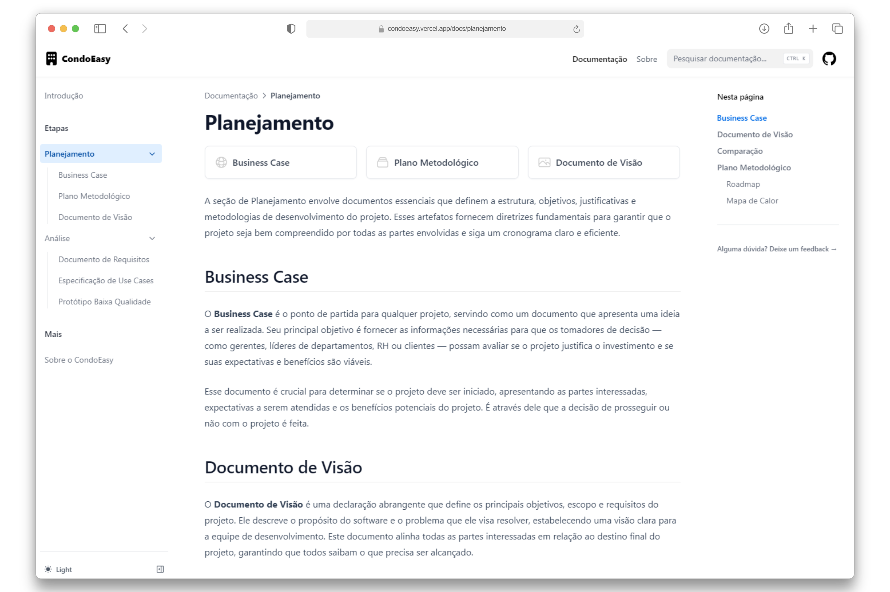

# CondoEasy Docs

Este repositório contêm a documentação do projeto **CondoEasy**, um app de gerenciamento de condomínios. Ele foi desenvolvido a partir do [Nextra](https://nextra.site), um template de documentação criado por Shuding.

[**Demo →**](https://condoeasy.vercel.app/)

## Clonando e fazendo deploy

Você pode clonar este repositório e fazer deploy na Vercel clicando no botão abaixo:

## Rodando localmente

Para rodar este projeto localmente, você precisa ter o [Node.js](https://nodejs.org/) e o [pnpm](https://pnpm.io/) instalados.

Após clonar o repositório, instale as dependências com `pnpm i`.

Em seguida, rode `pnpm dev` para iniciar o servidor de desenvolvimento e acesse localhost:3000.

## Licença

Este projeto é licenciado sob a licença MIT. Veja o arquivo [LICENSE](LICENSE) para mais detalhes.
